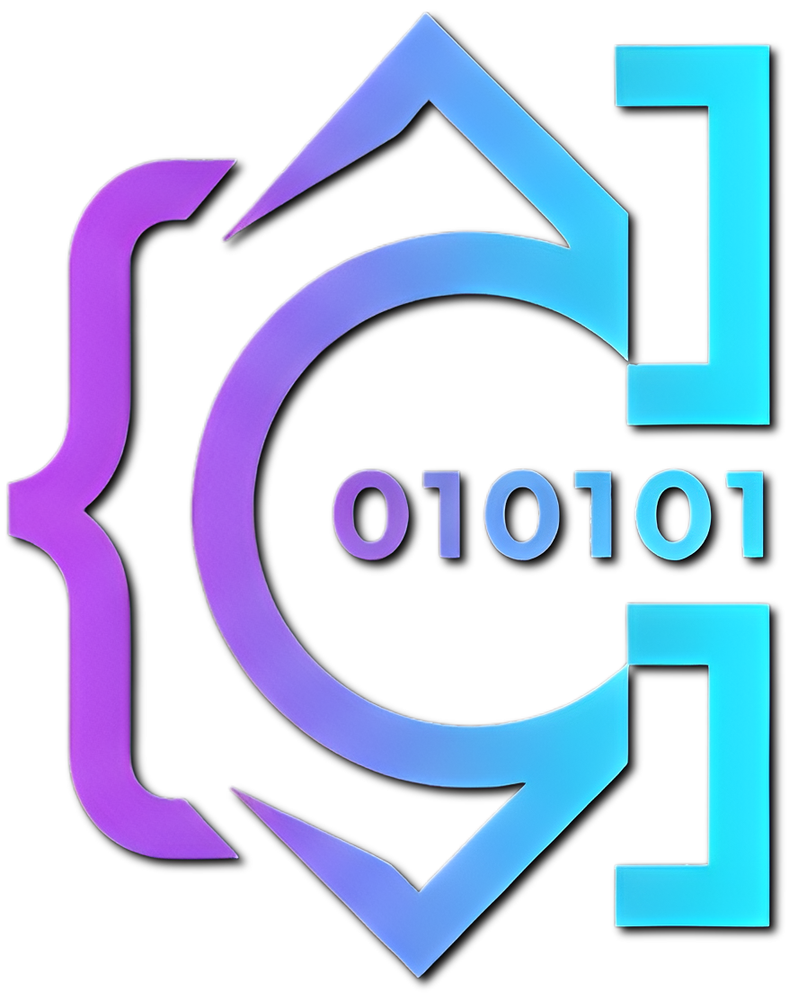

<div align="center">
  
  
  # Cipher Code Editor
  
  **Open source code editor with multi-model AI agent**
  
  
  
  
</div>

## ¿Qué es Cipher?

Cipher es un editor de código open source con agente IA multi-modelo. A diferencia de otros editores, tú eliges qué modelo IA usar: Claude, GPT, Gemini, Qwen, Kimi, o modelos locales vía Ollama y LM Studio.

## Características

- 🤖 Agente IA multi-modelo (Claude, GPT, Gemini, Qwen, Kimi, Grok, Ollama, LM Studio)
- 🧠 Memoria persistente por proyecto
- 🎨 Temas oscuro/claro totalmente personalizables
- 📦 Marketplace de prompts de la comunidad
- 🔀 Git integrado
- 💻 Terminal multi-pestaña
- 🔍 Debugger con IA
- 📝 Auto-generación de PROYECTO.md

## Instalación

```bash
git clone https://github.com/Rmatix/cipher.git
cd cipher
pnpm install
pnpm start
```

## Contribuir

Las contribuciones son bienvenidas. Abre un issue o un pull request.

## Licencia

MIT