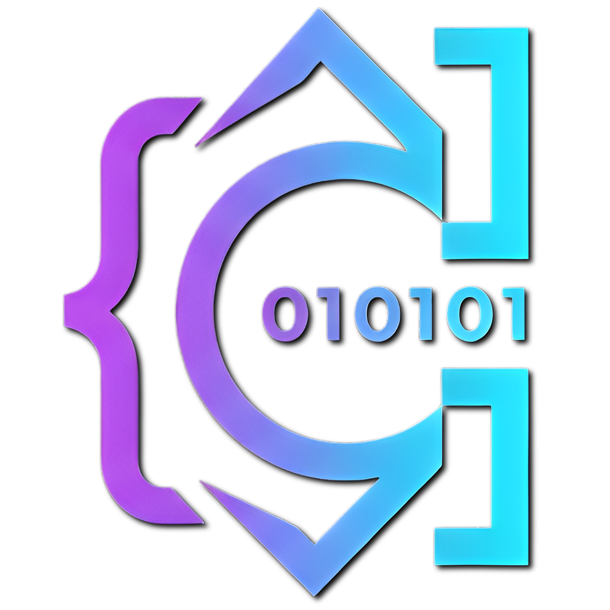

<div align="center">
  

  # Cipher Studio

  **Editor de código open source con Agente de IA Autónomo y soporte MCP nativo**

  
  
  
  
  
</div>

Cipher Studio es un editor de código open source para Windows, construido con Electron, React, TypeScript, Monaco Editor, Rust y Node.js. Incluye un Agente de IA Autónomo multi-proveedor, soporte nativo al Model Context Protocol (MCP), un Explorador SQL con creación de bases de datos físicas, terminal integrada y Git.

> Estado: versión `v2.8.0` estable. Verificado 100% libre de malware con VirusTotal. Anteriormente conocido como *Cipher Code Editor*, ahora unificado bajo el nombre **Cipher Studio** — mismo producto, mismo compromiso open source.

## Qué hay de nuevo en v2.8.0

### 🤖 Agente Autónomo
- El panel de IA ahora actúa como un **Agente Autónomo** moderno, capaz de planificar, ejecutar y componer cambios en múltiples archivos simultáneamente.
- **Directrices & Skills**: Soporte interactivo para cargar e inyectar directrices globales (`AGENTS.md`) y habilidades personalizadas (`.agents/skills/**/SKILL.md`) desde el panel de Agentes en Configuración.
- Burbujas de diálogo limpias, sin ruido visual. Espaciado consistente y estructura clara de respuestas.
- Soporte a **Composer**: modificación paralela de archivos con un panel de revisión de cambios antes de aplicar.

### 🔌 Panel de MCP Independiente (Model Context Protocol)
- Cliente MCP **real y funcional**: handshake `initialize`, descubrimiento de `tools/list` y ejecución de `tools/call` sobre transporte **Stdio** (comando local) y **SSE** (HTTP).
- Persistencia de servidores en `~/.cipher/mcp-servers.json` con auto-arranque opcional.
- Panel de control dedicado en el sidebar: registra, conecta/desconecta, prueba conexión y explora las herramientas que expone cada servidor.
- Estado de conexión en tiempo real (conectado / conectando / error) con el último mensaje de error visible.
- Completamente desvinculado del chat del agente para mantener la arquitectura limpia.

### 💾 SQL Explorer & Conexiones Docker
- Ahora puedes **crear nuevas bases de datos SQLite (.db)** directamente desde Cipher Studio.
- Soporte de conexiones nativas a **Contenedores Docker** con sub-motores (PostgreSQL, MySQL, SQL Server) y nombres de contenedor.
- Iconografía mejorada con **logotipos SVG originales y oficiales** para SQLite, PostgreSQL, MySQL, SQL Server y Docker.

### ⚙️ Panel de Ajustes Rework
- 5 pestañas con iconos en la barra lateral: Apariencia, API Keys, Atajos, Editor y Agentes.
- Pestaña de **Agentes** interactiva que te permite editar tus directrices globales y crear/eliminar tus propias Skills sin salir del editor.
- API keys configurables por proveedor y por modelo individual.

### 🎨 Rediseño Estético Global e Iconografía Expandida
- Interfaz más técnica y profesional: paleta desaturada, tipografía limpia, sin animaciones excesivas.
- Mapeo visual nativo con logotipos reales en el explorador de archivos para: Docker, npm y pnpm.

## Caracteristicas

### Editor

- Editor Monaco con tema oscuro Cipher, minimapa, ajuste de linea, formato y atajos de guardado.
- Ventana sin marco con esquinas redondeadas de `12px` en modo normal, rectangulares al maximizar.
- Logotipo e icono nativos de Cipher Studio en barra de tareas, acceso directo y menú de inicio.
- Explorador de archivos interactivo (el encabezado de carpeta abre diálogos del sistema para cambiar de espacio de trabajo).
- Indicadores Git completos en el árbol de archivos (los archivos modificados se pintan de amarillo/naranja con un badge `M`, los nuevos/untracked de verde con un badge `U` o `A`).
- Restauración del último proyecto: Cipher recuerda el último directorio de proyecto que tenías abierto al cerrarlo y lo abre automáticamente en el siguiente inicio.
- Explorador de archivos, busqueda de proyecto, panel Git y terminal integrada.
- Iconos SVG de Material Icon Theme para archivos y carpetas, con mapeo por nombre, extension y tipo de carpeta.
- Vista previa integrada para imagenes, audios y videos sin leer esos archivos como texto.
- Apertura de archivos Git y configuraciones comunes como `.gitignore`, `.gitattributes`, workflows y locks.
- Split Editor Down para dividir el editor activo hacia abajo.
- Boton Ejecutar en la barra superior: detecta el lenguaje del archivo activo y corre el comando correcto en la terminal integrada (`node`, `python`, `go run`, `cargo run`, `bash`, etc.).
- Panel inferior con `Problems`, `Output`, `Debug Console`, `Terminal`, `Ports` y `Cloud`.
- `Problems` analiza el archivo activo para detectar conflictos Git, `TODO/FIXME`, `console.log`, lineas largas y JSON invalido.
- `Ports` escanea puertos locales en escucha y permite abrir o copiar URLs `localhost`.
- `Cloud` reemplaza el panel exclusivo de Azure por un espacio unico para Azure, GCP y AWS con deteccion de CLI (`az`, `gcloud`, `aws`).

### Historial de cambios

- Cada vez que guardas un archivo (`Ctrl+S`) se crea una entrada en el historial automaticamente.
- El panel Historial muestra snapshots guardados y permite restaurar versiones anteriores al editor.
- El historial persiste entre sesiones via `localStorage` con maximo de 30 entradas por archivo.

### Temas

- Nueve temas incorporados de alta calidad: Midnight, Obsidian, Forest, Ocean, Aurora, Nordic Frost (Nord), Cyberpunk Neon, Monokai Retro y Snow Light (tema claro).
- Previsualización dinámica de temas mediante tarjetas que muestran una representación en miniatura de la interfaz.
- Soporte inteligente para temas claros y oscuros en Monaco Editor según el tema activo.
- Los colores se aplican mediante variables CSS al instante, sin recargar la app.

### Agente Autónomo

- Agente Autónomo con modos Chat, Composer y Dev.
- Soporte para OpenRouter, NVIDIA NIM, Ollama, LM Studio, Anthropic, OpenAI, Google Gemini, DeepSeek, Kimi y Qwen.
- Web search integrado para modelos OpenRouter compatibles.
- Thinking / Razonamiento para modelos compatibles, con acordeon visual de razonamiento.
- Contexto del archivo activo: el agente puede usar el contenido actual del archivo abierto, incluso si todavia no fue guardado.
- Compatibilidad inicial con Claude Code y OpenAI Codex CLI.
- Configuracion de API keys por proveedor y por modelo.
- **Configuración avanzada de Endpoints Personalizados:** Permite crear y agrupar múltiples modelos (cada uno con su nombre técnico y un alias opcional legible) bajo endpoints personalizados con URLs específicas para OpenRouter, NVIDIA NIM, Ollama (tanto servidores locales como remotos en la nube) u otros proveedores compatibles con OpenAI.
- **Detección dinámica de modelos:** Al guardar una API key en Configuración, Cipher consulta el endpoint de modelos del proveedor y lista automáticamente los que tu cuenta tiene disponibles. Ya no hay listas fijas ni modelos "Pronto" — solo aparecen los modelos reales a los que tienes acceso. El selector rápido de la barra superior y el del panel de IA están sincronizados y comparten el mismo cache de detección.
  - Ollama y LM Studio se autodetectan al inicio (servidores locales).
  - Anthropic no expone un endpoint público de listado, por lo que Cipher mantiene una lista mínima conocida y vigente.
- **Sincronización de Modelos en tiempo real:** El selector rápido de modelos de la barra superior (header) y el selector del panel lateral de IA están sincronizados al 100% y comparten el cache de detección dinámica.

### Interfaz

- Interfaz Electron sin marco, splash screen animado y controles tipo editor profesional.
- Modo enfoque (`Ctrl+K Z`) que oculta toda la UI excepto el editor.
- Atajos de teclado configurables desde Configuracion.
- Animaciones de entrada por panel y deteccion de Ollama local.
- Debugger IA: muestra errores y advertencias accionables del archivo activo y permite pedirle al agente que los corrija.
- Terminal redisenada con perfiles de shell, nuevo terminal, split terminal, limpiar, matar proceso, worktree, acciones rapidas y renombrado interactivo de terminales haciendo clic derecho (menú contextual) o doble clic sobre la pestaña/encabezado.

## Descargar

La build oficial se publica como instalador NSIS y ZIP para Windows en la sección de GitHub Releases.

Como la versión actual no está firmada con certificado de código, Windows SmartScreen puede mostrar una advertencia al ejecutar el instalador. Esto no significa que el archivo sea peligroso — puedes revisar y compilar el código fuente de este repositorio para verificarlo por tu cuenta.

## Requisitos

- **Sistemas Operativos**: Windows 10/11, macOS 10.15+ o distribuciones modernas de Linux (Debian, Ubuntu, Fedora, Arch, etc.).
- **Node.js**: versión 20 o superior.
- **pnpm**: versión 11 o superior.
- **Git**.
- **Herramientas de Compilación Nativas (requerido para `node-pty`)**:
  - **En Windows**: Visual Studio 2022 Build Tools (con C++ build tools, Windows 10/11 SDK y componentes Spectre-mitigated libs si compilas releases finales).
  - **En macOS**: Herramientas de Línea de Comandos de Xcode (`xcode-select --install`).
  - **En Linux**: Paquetes de desarrollo básicos (`gcc`, `g++`, `make`, `python3`).
    - En Ubuntu/Debian: `sudo apt install build-essential python3`
    - En Fedora/RHEL: `sudo dnf groupinstall "Development Tools" && sudo dnf install python3`

La terminal integrada usa `node-pty`, una dependencia nativa que compila partes en C++. Asegúrate de cumplir con los requisitos anteriores antes de instalar las dependencias o el proceso fallará.

## Compilar desde codigo fuente

Clona el repositorio:

```bash
git clone https://github.com/Rmatix/cipher.git
cd cipher
```

Instala dependencias:

```bash
pnpm install
# Solo en Windows (requerido para el empaquetador del instalador):
pnpm approve-builds electron-winstaller
```

Ejecuta en desarrollo:

```bash
pnpm dev
```

Compila el renderer:

```bash
pnpm build
```

Empaqueta para tu sistema actual:

```bash
# Empaqueta y distribuye instaladores locales según el sistema actual
pnpm dist
```

O empaqueta específicamente para tu plataforma usando los comandos dedicados:

- **Para Windows** (genera instalador `.exe` NSIS y `.zip` ejecutable):
  ```bash
  pnpm dist:win
  ```
- **Para macOS** (genera imagen `.dmg` y `.zip` de la app desde un sistema macOS):
  ```bash
  pnpm dist:mac
  ```
- **Para Linux** (genera paquetes autoejecutables `.AppImage`, instalador `.deb` y archivo comprimido `.tar.gz` desde un sistema Linux):
  ```bash
  pnpm dist:linux
  ```

Los artefactos generados quedan en `release/`. Esa carpeta no se sube al repositorio.

## Compilación en Sistemas UNIX (macOS y Linux)

Para compilar Cipher en sistemas operativos UNIX (macOS, Linux), asegúrate de contar con los compiladores nativos, Node.js y la cadena de herramientas de Rust instalada.

### Prerrequisitos

1. **Rust y Cargo**:
   Instala Rustup (el instalador oficial de Rust):
   ```bash
   curl --proto '=https' --tlsv1.2 -sSf https://sh.rustup.rs | sh
   ```
   Asegúrate de tener `cargo` disponible en tu PATH:
   ```bash
   rustc --version
   ```

2. **Compiladores del Sistema**:
   - **En macOS**: Instala las herramientas de línea de comandos de Xcode ejecutando:
     ```bash
     xcode-select --install
     ```
   - **En Linux (Debian/Ubuntu)**: Instala las herramientas de desarrollo esenciales:
     ```bash
     sudo apt update
     sudo apt install -y build-essential python3
     ```

3. **Node.js y pnpm**:
   Instala Node.js v20+ y habilita/instala `pnpm`:
   ```bash
   corepack enable pnpm
   # O instala pnpm globalmente:
   npm install -g pnpm
   ```

### Pasos de compilación e instalación

Una vez configurados los prerrequisitos, ejecuta los siguientes comandos desde la raíz del proyecto para instalar las dependencias y levantar el entorno de compilación nativo:

```bash
# Instalar dependencias del proyecto (compilará node-pty y enlazará las dependencias nativas)
pnpm install

# Compilar el frontend (React/TypeScript/Vite)
pnpm build

# Ejecutar Cipher en modo de desarrollo
pnpm dev

# Compilar y empaquetar instaladores y binarios específicos según tu sistema operativo
# En macOS:
pnpm dist:mac

# En Linux:
pnpm dist:linux
```

## Build sin firma

Esta version experimental se distribuye sin firma digital. Para generar una build ZIP sin firma desde tu maquina puedes usar:

```bash
pnpm build
pnpm exec electron-builder --win zip --x64 --config.directories.output=release-build-nosign --config.win.signAndEditExecutable=false
```

Nota: `signAndEditExecutable=false` evita problemas de permisos con `winCodeSign`, pero puede impedir que Electron Builder inserte correctamente el icono del `.exe`. Para un release final con icono embebido usa `pnpm dist`.

## Firma digital

Firmar el ejecutable sirve para reducir advertencias de Windows SmartScreen y demostrar que el archivo viene del publicador original.

Para firmar builds de Windows necesitas:

- Un certificado de firma de codigo emitido por una autoridad certificadora, por ejemplo SSL.com, DigiCert o Sectigo.
- Configurar Electron Builder con el certificado (`CSC_LINK` y `CSC_KEY_PASSWORD`) o firmar manualmente con `signtool.exe`.
- Mantener protegida la clave privada del certificado.

Mientras Cipher no tenga certificado, las releases pueden publicarse como builds oficiales sin firma, indicando claramente esta condicion.

## Comandos disponibles

```bash
pnpm install       # Instala dependencias
pnpm dev           # Vite + Electron en modo desarrollo
pnpm start         # Ejecuta Electron con build existente
pnpm build         # Compila el renderer de produccion
pnpm pack          # Genera app desempaquetada con electron-builder
pnpm dist          # Genera artefactos segun el sistema actual
pnpm dist:win      # Genera instalador y ZIP de Windows
pnpm dist:mac      # Genera DMG/ZIP de macOS desde macOS
pnpm dist:linux    # Genera AppImage/DEB/tar.gz de Linux desde Linux
pnpm lint          # Revisa el renderer con ESLint
pnpm preview       # Preview local del renderer
```

## Estructura

```text
cipher/
  src/
    main/              Proceso principal de Electron e IPC
  renderer/
    src/
      components/
        ai/            Agente IA y panel de chat
        debug/         Debugger IA
        editor/        Monaco Editor y vista previa multimedia
        history/       Panel de historial de cambios
        layout/        Titlebar, Sidebar, Panel y StatusBar
        memory/        Memoria de proyecto
        settings/      Configuracion y temas
        shared/        Componentes reutilizables
        sidebar/       Explorador, busqueda y Git
        terminal/      Bottom panel, terminal, ports y cloud
      store/           Estado global (Zustand)
      utils/           Utilidades de archivos, lenguaje e iconos
    public/
      material-icons/  Iconos SVG de Material Icon Theme
    vite.config.ts     Build del renderer hacia src/renderer-dist
```

## Núcleo en Rust (Cipher V2)

Para optimizar el rendimiento y minimizar el consumo de memoria RAM al interactuar con modelos de lenguaje locales (como Ollama y LM Studio), Cipher V2 incorpora una arquitectura híbrida de alto rendimiento.

El núcleo de Rust (gestionado vía `Cargo.toml`) procesa de manera nativa tareas pesadas y de alta latencia en hilos dedicados, liberando al hilo principal de Node/Electron:
- **Procesamiento de texto pesado**: Lectura, limpieza y chunking optimizado de archivos de gran tamaño.
- **Tokenización ultrarrápida**: Estimación de tokens y recorte inteligente del contexto del prompt para no exceder los límites del contexto del modelo.
- **Indexación y Búsqueda Vectorial**: Indexado semántico local en memoria para buscar fragmentos relevantes del proyecto rápidamente.
### Arquitectura híbrida Rust

Cipher V2 incorpora un módulo nativo escrito en **Rust** (`native/`) que expone una API **Node‑API (N‑API)** a través de `src/lib.rs`. Este módulo se encarga de tareas de alto costo computacional como:

- **Indexación de archivos** y generación de tokens para los modelos de IA locales.
- **Tokenización y recorte de contexto** ultra‑rápidos.
- **Búsqueda vectorial** en memoria para encontrar fragmentos relevantes del proyecto.

Los botones del panel **Workflows** ejecutan los comandos de Cargo correspondientes:

* **Cargo Build** – `cargo build` (compila el módulo y genera `cipher_native.dll`/`libcipher_native.so`).
* **Cargo Check** – `cargo check` (analiza sin generar artefactos).

> **Requisitos**: Tener instalado el toolchain de Rust (`rustup`, `cargo`) y que esté disponible en `PATH`. En entornos UNIX (macOS / Linux) se requiere `rustup` y los compiladores del sistema; en Windows se usa la misma herramienta a través de `cargo`.

## Configuracion IA

- OpenRouter, NVIDIA NIM, Anthropic, OpenAI, Google, DeepSeek, Kimi y Qwen requieren API key.
- Ollama requiere el servicio local en `http://localhost:11434`.
- LM Studio requiere el servidor local compatible con OpenAI en `http://localhost:1234/v1`.
- Los modelos personalizados permiten guardar proveedor, ID, URL base opcional y API key.
- Web search solo funciona con modelos de OpenRouter que aceptan herramientas de busqueda.
- Thinking / Razonamiento depende de que el modelo/proveedor soporte razonamiento extendido.
- Claude Code se comprueba con `claude --version` y puede ejecutarse en modo Dev con `claude -p`.
- Codex CLI se comprueba con `codex --version` y puede ejecutarse en modo Dev con `codex exec`.

## Atajos de teclado

| Accion | Atajo por defecto |
|---|---|
| Guardar archivo | Ctrl+S |
| Formatear documento | Ctrl+Shift+F |
| Paleta de comandos | Ctrl+Shift+P |
| Abrir agente IA | Ctrl+Shift+A |
| Abrir memoria | Ctrl+Shift+M |
| Abrir debugger IA | Ctrl+Shift+D |
| Abrir explorador | Ctrl+B |
| Mostrar/ocultar terminal | Ctrl+` |
| Modo enfoque | Ctrl+K Z |

Todos los atajos son configurables desde Configuracion.

## Contribuir

Las contribuciones son bienvenidas. Puedes ayudar reportando bugs, probando builds, mejorando la interfaz, agregando integraciones o proponiendo nuevas funciones.

Antes de abrir un pull request:

```bash
pnpm lint
pnpm build
```

Lee [CONTRIBUTING.md](CONTRIBUTING.md) para mas detalles.

## Donar

Si Cipher te parece util y quieres apoyar su crecimiento, puedes donar o contactarme desde mi portafolio de GitHub:

[Rmatix/Rmatix](https://github.com/Rmatix/Rmatix)

Los donativos ayudan a mejorar el proyecto con mejores builds, firma digital, pruebas en mas equipos, diseño, documentacion, nuevas funciones de IA y mas tiempo de desarrollo.

## Repositorio

Repositorio oficial: [Rmatix/cipher](https://github.com/Rmatix/cipher)

## Licencia

MIT
